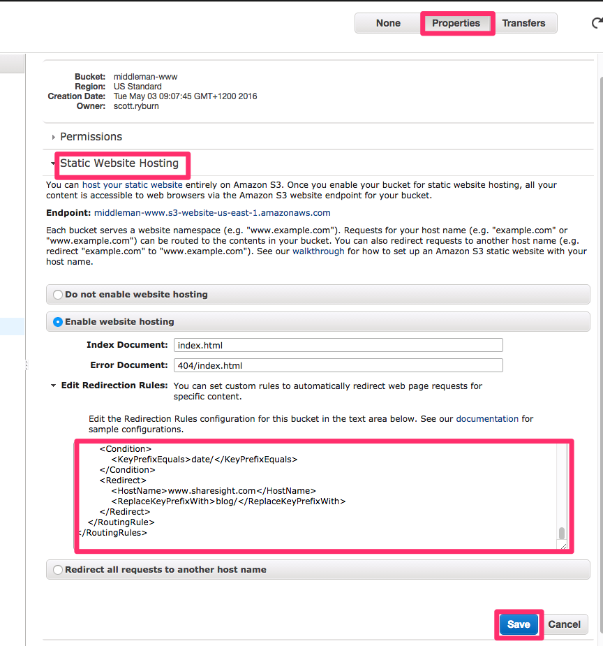

# Sharesight's Static Marketing Website

## Dependencies

- Ruby 2.4.2+
- Middleman 3.4.1

## Installation

1. Clone this repo into a local directory
2. Change to your new local directory
3. Setup local environment keys.  `.envrc` works great!  See `howtos/environment.md`.
4. `bundle install && yarn`
5. `yarn start` – it's not a javascript package, but it's helpful nevertheless

Individual Commands (see package.json):
1. Load content: `middleman contentful`
2. Build the site: `middleman build`
3. Or run a local server: `middleman`

## Testing

Most things are tested – both in `rspec` and `jest`.  Every page is tested that it renders, has a title, meta tags, etc.

You need to install packages and run `yarn contentful` first.

Commands (see package.json):
 - `yarn test`
 - `yarn rspec` / `yarn rspec:tdd`
 - `yarn jest` / `yarn jest:tdd`

## Testing Coverage Holes

	1. Extensions are not tested
	2. The logic in the config file is not tested.

## Cloudfront Localization via Lambda
 - See `lambda/README.md`!

## Manual Deploys

The website automatically deploys to staging and production from the Travis-CI
build, so normally you don't need to deploy anything manually.

### Building/Deploying to STAGING:

1. Create PR
2. Merge PR into `develop` branch.
3. Travis will deploy it to `staging-www.sharesight.com`.
4. Once build is complete, may take up to 15 minutes to resolve caches.

*Note:* When Travis-CI builds the `develop` branch, it will automatically deploy
the code to `staging-www.sharesight.com` after any successful build. The
instructions below are just for those cases when you want to manually deploy.

Make sure you've modified your configuration settings (as described below) before proceeding with deploying to staging or production.

		git checkout develop
		git pull origin develop
		APP_ENV=staging bundle exec middleman build
		APP_ENV=staging bundle exec middleman s3_sync

### Building/Deploying to PRODUCTION:

1. Merge PR into `master` branch.
3. Travis will deploy it to `www.sharesight.com`.
3. Once build is complete, may take up to 15 minutes to resolve caches.

*Note:* When Travis-CI builds the `master` branch, it will automatically deploy
the code to `www.sharesight.com` after any successful build. The
instructions below are just for those cases when you want to manually deploy.

Make sure you've modified your configuration settings (as described below) before proceeding with deploying to staging or production.

		git checkout master
		git pull origin master
		APP_ENV=production bundle exec middleman build
		APP_ENV=production bundle exec middleman s3_sync

## How to add a new Locale

0. Use proper language and country codes – there's a reason why UK is GB.  https://en.wikipedia.org/wiki/ISO_3166-1_alpha-2
1. Open `data/locales.json` and copy one of the existing locales.  *The first locale is the default: global*
 	Ensure to maintain capitalization – the `id` field should be lowercased.
2. Create the file `plans/[country_id].json`. Every plan defaults from `plans/[default_locale_id].json` (via merge), so only overrides need to be in the country plans file.
3. Ensure the Helpsite and Marketing site have the same locales!  Else you will link to a non-existent locale.

Do note, the default_locale_id is set in config.rb.

## How to change the redirection rules on Amazon S3

  1. Change the XML source file

        # for production
        s3/www.sharesight.com_redirection_rules.xml

        # for staging
        s3/staging-www.sharesight.com_redirection_rules.xml

  2. Commit and push your changes
  3. Copy the content of the file to the
  [production bucket properties](https://console.aws.amazon.com/s3/home?region=us-west-1#&bucket=middleman-www&prefix=)
  or
  [staging bucket properties](https://console.aws.amazon.com/s3/home?region=us-west-1#&bucket=staging-middleman-www&prefix=)
  on AWS

    using `Properties`, then `Static Website Hosting`, and finally paste
    them into the textarea

    

    and press the `Save` button.
