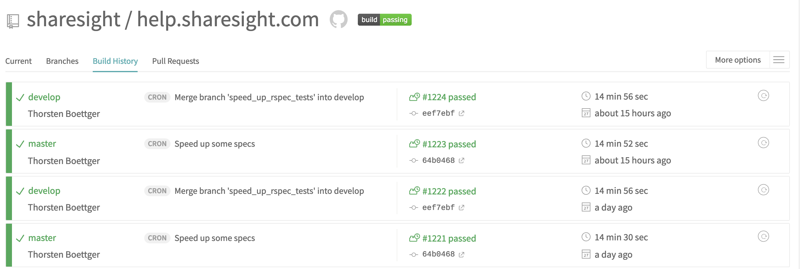
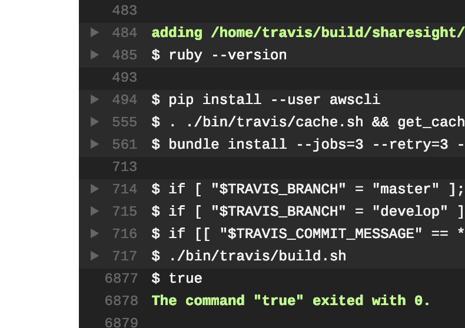
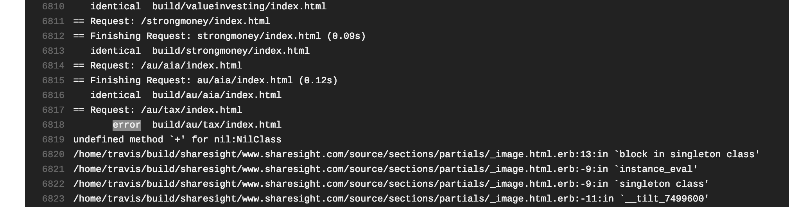

# Figuring Out Middleman Build Problems

For the *marketing* site, look at: https://travis-ci.org/sharesight/www.sharesight.com

For the *help* site, look at: https://travis-ci.org/sharesight/help.sharesight.com

You'll see the current builds going on, and if you look into the `Build History` tab (e.g. https://travis-ci.org/sharesight/help.sharesight.com/builds) also the recent ones.  You can also look under branches, if you're only interested in one (say `develop` for the staging site).



Click on the build number link (e.g. `#1224 failed`) to dig in further. You'll see the sub-tasks (e.g. *Build*, *Test*, *Deploy*) marked with a tick if they passed or cross if they failed. Clicking on the failed task will show you more details, including the log file.

The log files are pretty huge, so it's best to search in the page ('error' is a good starting search) to find what went wrong. Travis also collapses sections, so you might need to click on the triangle icon on the left to expand a section too.



## Example errors and what they might mean

Please add more error types here and possible solutions as we see different sorts of things.

### NilClass?

From https://travis-ci.org/sharesight/www.sharesight.com/jobs/506086753



```
 error  build/ca/tax/index.html
undefined method `+' for nil:NilClass
```

If you see this pattern: `undefined method `something` for nil:NilClass` it means there's a blank field that Ruby is trying to process (in this example, it's trying to add/concatenate it with a `+` operation). 

*Solution*: Look for a field that's blank and related to the page mentioned - a tax reporting landing page, here, from the looks of it.

### NoMethodError for <Contentful::Asset

From https://travis-ci.org/sharesight/www.sharesight.com/jobs/506027745


```
NoMethodError: undefined method `title' for <Contentful::Asset id='6rjArUk7BRsU9nUYA8jViB' url=''>:Contentful::Asset
```

This is similar to the problem above, suggesting a title hasn't been entered yet for something. Contentful automatically generates Ruby methods based on the data it has, so if the data hasn't been entered yet, it won't create a method for that field.

You can also see in the screenshot that it was working on the _partners_ pages when the error occurred, so that's a good place to start looking for the problem.

*Solution*: Look for a recently edited entry—starting with partner pages—missing that field (in this case, a title).

